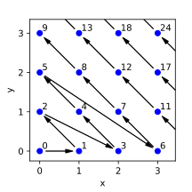
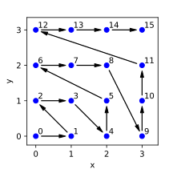

#+options: ^:nil
#+title: State machines, dynamic multi-dispatch, and pairings of natural numbers

Recently at work I had to write a state machine in C++20. At the
expense of being redundant given the target audience of this post, let
us recall that a state machine evolves over time by changing its
internal state each time it is fed some input. Having to execute some
logic based on /both/ the current state and the input being fed
implies implementations must use some kind of /dynamic multi-dispatch/
technique.

In C++ there are well-known approaches to do this using =std::variant=
and =std::visit= (see [[https://khuttun.github.io/2017/02/04/implementing-state-machines-with-std-variant.html][Kalle Huttunen's post]], [[https://github.com/mpusz/fsm-variant][Mateusz Pusz's library]],
or similar).  It is also possible to implement with inheritance-based
dynamic polymorphism using something like the visitor pattern.  The
problem is that due to circumstances of life and past decisions (of my
authoring) the dispatch mechanism must not be based on types, but
based on =enum= values.

Using some mathematical and metaprogramming tricks the problem can be
solved and even extended to work for the n-ary case --- maybe not
something I'd recommend if compilation times are of any concern at
all, but I found this cool anyways.

* The problem setup

In order to have something concrete in mind, we will use the finite
state machine (FSM) described by the following transition table

| State\Event   | a | b | c |
|---------------+---+---+---|
| A (initial)   | A | B | C |
| B             | B | C | D |
| C             | C | B | D |
| D (final)     | - | - | - |

where '-' is used to indicate that there are no transitions from
state-input pair at all and we consider that to be an error.  We could
make instead an error state and have several final states, that would
not affect our multi-dispatch solution so let us not waste time in the
finer semantic details of the FSM.

The =enum= types for this state machine are defined as follows

#+include: ./code/basic.cpp src c++ :lines "192-194"

A naive solution can make use of nested conditionals to choose a
behavior based on the value of state and input:

#+include: ./code/bad_switch_opt.cpp src c++ :lines "20-68"

But this has a couple of issues:

1. **Maintainability**: These =enum= enumerate a short list of values,
   my practical case would not fit as nicely in the page nor the code
   would be as easy to follow.  Regardless, my initial solution was
   this simple and I found it was not only hard to read, but also it
   made some other trade-offs which ended up introducing some
   technical debt (likely just a skill-issue of mine).

2. **Double jumps**: The example above does not have /one/ jump, but
   two!  First there is a jump based on =state=, then there is a jump
   based on =input=. My hypothesis is that this is potentially
   problematic for the CPU and the compiler:

   - For the CPU: The extra branching by itself may not be that much
     of an issue on some modern CPUs as long as the transition
     patterns are [[https://lemire.me/blog/2026/03/18/how-many-branches-can-your-cpu-predict/][predictible]]. However, the double jump may be
     problematic to the instruction cache (the intermediate =case=
     blocks may be too far apart, e.g. due to =-malign-labels=), or
     make inefficient use of the instruction fetch unit (e.g. Skylake
     fetches 16 bytes per cycle).

   - <<switch-lowering>> /"Huh, but the compiler will surely optimize
     away the nesting"/: It turns out compilers are not that good at
     optimizing nested switches --- check this simple example on
     [[https://godbolt.org/z/Y15sGc61e][Compiler Explorer and GCC 11.2]].  Lowering of =switch= statements
     depends on [[https://youtu.be/gMqSinyL8uk][a lot of stuff]], in particular the distribution of the
     values on the =case= labels seems to be very relevant.  Having a
     dense distribution of these values when there is a large number
     of cases encourages the compiler to generate /jump tables/,
     deemed more #performant than the alternative trickery (search
     algorithms, apparently).

So now we will try to come up with something nicer, which hopefully
requires a single jump and provides some improvement in
maintainability by generating the jump table automatically at compile
time --- although some would argue the resulting template
metaprogramming becomes the new maintainability burden, a valid point.

* The math

Summarizing, we need to convert the double jump caused by a nested
=switch= into a single jump. Each =case= label is associated to *one*
=integral= value. A double jump therefore requires *two* =integral=
values to dispatch. Therefore we need to:

1. *convert* /two =integral= values into one =integral= value/ at
   *compile-time*, and

2. *convert back* /one =integral= value into two =integral= values/,
   at *compile-time*.

For this section we leave the compile time requirements aside and deal
only with the conversions.  Moreover, we will restrict the problem to
=unsigned integral= values. The resulting problem screams [[https://en.wikipedia.org/wiki/Pairing_function][pairing
function]]!

Note. One-paragraph-context for those not familiarized with the
concept: a pairing function is an invertible function (a bijection)
between the set of natural numbers ($\mathbb{N}$) and the set of pairs
of natural numbers ($\mathbb{N} \times \mathbb{N}$).  Pairing
functions are used, for example, to demonstrate that $\mathbb{N}$ and
$\mathbb{N} \times \mathbb{N}$ have the same "size" --- an unintuitive
result at first because a finite set $S$ does not have a bijection
with $S \times S$, but things become odd when sets are infinite.

There are [[https://drhagen.com/blog/superior-pairing-function/][many pairing functions]], I considered the following:

- Pairing based on the [[https://en.wikipedia.org/wiki/Fundamental_theorem_of_arithmetic][Fundamental Theorem of Arithmetic]]. This pairing
  function uses the fact that any integer greater than $1$ has a
  unique representation as a product of powers of primes.  Such a
  pairing $f$ can be defined as

  \[
     f : \mathbb{N} \times \mathbb{N} \to \mathbb{N},\quad f(a,b) := 2^a 3^b.
  \]

  After staring at the definition of $f$ for a while, it is clear that
  we cannot use this pairing for at least two reasons:

  - First, the range of $f$ is too sparse. Two numbers in the range of
    $f$ have a gap between them of at least a factor of $2$ between
    them.  This is likely to have a [[switch-lowering][negative effect on the code
    generated]] for the =switch= whose =case= labels are associated to a
    subset of the range of $f$.

  - The second problem has to do with the finite nature of computers.
    In computers we do not work with $\mathbb{N}$, but with
    =std::uint64_t= at best (leaving =BigInt= out of the question, we
    are doing #performance). Trouble would arise when the sum of the
    =enum= values $a$ and $b$ being mapped is equal to or greater than
    $64$, because

      \[ f(a,b) \geq 2^a3^b \geq 2^{a+b} \gt 2^{64}-1 \]

    overflows =std::uint64_t=!

  (For those interested in the inverse $f^{-1}$, I recommend the
  introductory chapters on recursive functions in [[https://www.cambridge.org/core/books/computability-and-logic/440B4178B7CBF1C241694233716AB271][Computability and
  Logic by Boolos, Burgess, & Jeffrey 5th ed]])

- The [[https://en.wikipedia.org/wiki/Pairing_function#Cantor_pairing_function][Cantor pairing function]] is historically the first pairing
  function (as far as I know). It can be visualized in the a 2D graph
  as a walk through the diagonals of the graph.

  #+CAPTION: Cantor pairing function (image from [[https://drhagen.com/blog/superior-pairing-function/][drhagen's blog]])
  #+NAME: fig:cantor_pairing
  

  Hopefully it is not hard to observe that the Cantor pairing function
  is not as overflow prone as the one based on the Fundamental Theorem
  of Arithmetic (the gap between subsequent steps of the walk does not
  increase by powers of $2$). However --- as shown in
  [[https://www.vertexfragment.com/ramblings/cantor-szudzik-pairing-functions/][this
  blog that does a much better job than I can at explaining the
  sparsity of the function]] --- even for the set $S := \{(x, y) \in
  \mathbb{N} \times \mathbb{N} : x, y \lt 10 \}$ we get lots of gaps
  in the subset of the range of the Cantor function corresponding to
  $S$.  We can do much better.

- The [[http://szudzik.com/ElegantPairing.pdf][Szudzik pairing function]] is relatively recent (given that the
  last two entries were from the early 1900s and the late 1800s,
  respectively). It too can be visualized as a walk through a graph,
  but this time the walk follows the sides of increasingly larger
  squares.

  #+CAPTION: Szudzik pairing function (image from [[https://drhagen.com/blog/superior-pairing-function/][drhagen's blog]])
  #+NAME: fig:cantor_pairing
  

  The approach of Szudzik achieves a very dense range (as shown in the
  aforementioned [[https://www.vertexfragment.com/ramblings/cantor-szudzik-pairing-functions/][blog]] entry), which is perfect for our needs.

So we will go with Szudzik's approach, whose formula reads

\begin{equation*}
  s(x, y) :=
  \begin{cases}
  x + y^2 &\text{if } y \ge x\\
  x^2 + x + y&\text{otherwise}
  \end{cases},
\end{equation*}

and we implement in C++20 as below

#+include: ./code/basic.cpp src c++ :lines "39-43"

Note. =unsigned_arithmetic_result_t= is similar to
=std::common_type_t= in spirit. It is basically the smallest unsigned
integral type that can accommodate for the result of operations
between =T= / =S=, =T= / =T=, and =S= / =S=.  Enabling
=-Wsign-conversion= makes the return statement explode due to the
[[https://en.cppreference.com/cpp/language/usual_arithmetic_conversions][usual arithmetic conversions]], but I haven't found a way to get rid of
those errors with which I'm happy with.

The inverse of the Szudzik pairing is given by

\begin{equation*}  
 s^{-1}(z) :=
   \begin{cases}
  (z - (\lfloor \sqrt{z} \rfloor)^2, \lfloor \sqrt{z} \rfloor) &\text{if } z - (\lfloor \sqrt{z} \rfloor)^2 < \lfloor \sqrt{z} \rfloor \\
  (\lfloor \sqrt{z} \rfloor, z - (\lfloor \sqrt{z} \rfloor)^2 - \lfloor \sqrt{z} \rfloor) &\text{otherwise}
  \end{cases}.
\end{equation*}  

which is implemented with the following snippet

#+include: ./code/basic.cpp src c++ :lines "49-77"

Here we had to implement our own =unsigned integral= approximation of
the square root and take some precautions to preserve =constexpr=, but
nothing too crazy. Now we only need some metaprogramming to glue
things together.

* The solution

* Beyond the solution: going variadic

* Conclusion
