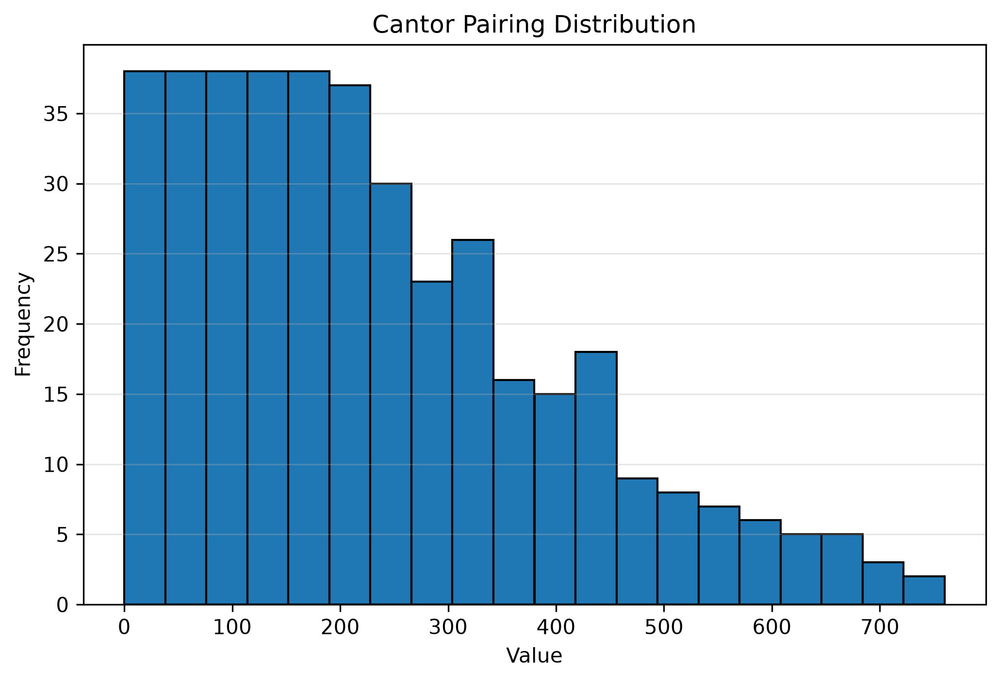
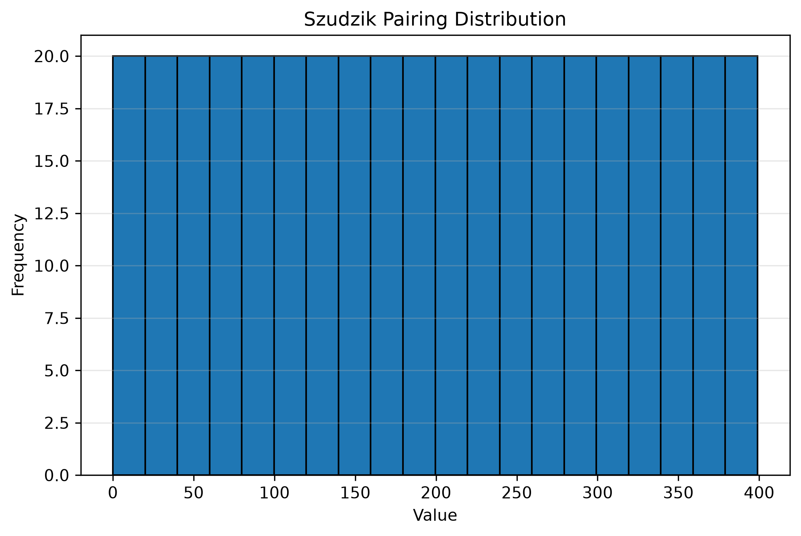

#+title: State machines, dynamic multi-dispatch, and pairings of natural numbers

Recently at work I had to write a finite state machine in C++20.  A
state machine evolves over time by changing its internal state each
time it is fed some input. Having to execute logic based on /both/ the
current state and the input being fed implies that implementations
must use some kind of /dynamic multi-dispatch/ technique.

In C++ there are well-known approaches to implement state machines
using [[https://khuttun.github.io/2017/02/04/implementing-state-machines-with-std-variant.html][=std::variant= and =std::visit=]].  It is also possible to
implement state machines with inheritance-based dynamic polymorphism
using something like the [[https://www.spigotmc.org/threads/implementing-finite-state-machines-with-visitor-design-pattern.336273/][visitor pattern]].  Due to circumstances of
life and past decisions (of my authoring) the dispatch mechanism I had
to implement was not based on types, but based on =enum= values.  This
rendered the former two mechanisms unsuitable for my use-case.

The solution I will present for this problem makes use of some maths
and metaprogramming. After presenting the solution for the binary case
(sufficient for implementing a state machine), I will present its full
generalization to dynamic dispatch based on an arbitrary number of
=enum= values.

* Problem setup

In order to have something concrete in mind, we will use the finite
state machine (FSM) described by the transition table below.

| State\Event   | a | b | c |
|---------------+---+---+---|
| A (initial)   | A | B | C |
| B             | B | C | D |
| C             | C | B | D |
| D (final)     | - | - | - |

A dash ('-') is used to indicate that there are no transitions from
the =(state, input)= pair of the given row and column.  Reaching such
transitions is considered an error.  Alternatively, we could make an
error state and have several final states.  Representing errors in one
way or the other would not affect our multi-dispatch solution, so we
will not be wasting any more time on the finer details of the FSM
construction.

The =enum= types for this state machine are defined as follows

#+include: ./code/basic.cpp src c++ :lines "281-283"

A naive solution can make use of nested conditionals to choose a
behavior based on the values of state and input:

#+include: ./code/bad_switch_opt.cpp src c++ :lines "20-68"

But this has a couple potential issues:

1. **Maintainability**. The =enum= types in the example enumerate a
   short list of values.  Some FSMs that show up in practice would not
   fit as nicely in the page.  Regardless, my initial solution was
   this simple.  Yet in the end I found not having a construct that
   clearly separates dispatching logic from business logic to be a
   maintainability burden.

2. **Suboptimal?** Maybe. In all honesty, I have not played with
   (profiled) =switch= optimizations as much as [[https://xoranth.net/verb-parse/][other people have]]. But
   in this post I want to experiment with branching based on a single
   value that encodes =state= and =input=, instead of sequentially
   branching based on individual =enum= values.  Additionally, it
   would be nice for these encoded values to be densely distributed
   since this encourages the compiler to [[https://youtu.be/gMqSinyL8uk][lower the =switch=]] to a
   compactly represented /jump table/.

* An incomplete solution

We begin designing the solution by specifying the signature of the
function that performs dynamic dispatch over =enum= values, and
showing one possible way to use this function to implement the FSM of
the previous section.

The signature of the dispatching function is

#+include: ./code/basic.cpp src c++ :lines "203-207"

Note. The =enum_values= tag lifts the values enumerated by =StateT=
and =InputT= into types --- basically a type alias to an
=std::integral_constant= of a tuple-like type.

The previously described FSM can be implemented using =dispatch_enum=
in the following manner:

#+include: ./code/basic.cpp src c++ :lines "299-352"

Input is fed to the state machine using the =fsm::transition=
function.

#+include: ./code/basic.cpp src c++ :lines "354-359"

From both the signature of =dispatch_enum= and its expected usage we
can come up with a rough plan to implement =dispatch_enum=.  We will
divide the algorithm into two parts: compile time and runtime work.

1. At compile time

   1. <<step-1-1>> List the values enumerated by =StateT= and
      =InputT=, denote them =states= and =inputs=, respectively.

   2. <<step-1-2>> Map each value in =states= to a distinct
      =integral=.  Do the same with =inputs= (one input and one state
      may share a mapping value).  Denote that mapping function by
      =u=.

   3. Obtain the cartesian product of the lists of =integral= values
      from the previous step.

   4. <<step-1-4>> Encode each pair in the cartesian product to a
      unique =integral= using an encoding function =e=.  Denote the
      resulting list by =encodings=.

      Note. The last three steps can be summarized in a mathematical
      formula as obtaining the set of =encodings= given by

      \[\{ e(u(state), u(input)) : state \in StateT, input \in InputT\}.\]

   5. Construct a dispatching mechanism (=switch=) based on a single
      runtime value, using the values in =encodings= as the
      discriminants (values associated to =case= labels).

   6. <<step-1-6>> Inside each =case= block, where the associated
      discriminant =d= is known at compile time, use the inverse of
      the encoding function =e= and the inverse of =u= to obtain
      compile time values =(state, input)= such that =e(u(state),
      u(input)) = d=.  Immediately after, invoke the argument function
      =f= using an =enum_values= tag constructed from =state= and
      =input=.

      Note. The inverses of =e= and =u= exist because of the "unique"
      and "distinct" requirements in their defining wordings (at steps
      [[step-1-4][1.4]] and [[step-1-2][1.2]], resp.).

2. At runtime

   1. Obtain the encoding of the input arguments =encoded =
      e(u(state), u(input))=.

   2. Dispatch using =encoded= as the sole argument on which branching
      is based.

The enumeration of values enumerated by an =enum= in [[step-1-1][step 1.1]] can be
obtained in a variety of ways.  I chose to use the
=magic_enum::enum_values= function from the infamous [[https://github.com/Neargye/magic_enum/tree/master][magic_enum]]
library.  I think that library allows me to provide the cleanest API
in the pre reflection era (recall the solution is constrained to
C++20).

The function =u= of [[step-1-2][step 1.2]] can be a =static_cast= from an =enum= to
its =std::underlying_type_t=.  Its inverse, which is required for [[step-1-6][step
1.6]], is the construction of an =enum= from a value of its underlying
type --- possible via brace-initialization since C++17, see [[https://www.open-std.org/jtc1/sc22/wg21/docs/papers/2016/p0138r2.pdf][P0138]].

For the metaprogramming required to do most of the compile time work
as well as for the generation of the dispatching logic from a single
encoding value, I chose to use the metaprogramming library [[https://www.boost.org/doc/libs/latest/libs/mp11/doc/html/mp11.html][Boost.Mp11]].

The only remaining blank is the encoding function =e=.  Here is where
the maths explained in the next chapter comes in.  Leaving the
definition of the encoding function in suspense for now, the algorithm
just described can be written as follows

#+NAME: listing:basic-solution
#+CAPTION: Basic solution with missing encoding function
#+include: ./code/demo_basic.cpp src c++ :lines "1-44"

* Completing the solution: encoding pairs

In order to fill the missing blanks in [[listing:basic-solution][Listing 1]] , we need to define
an encoding function, that is, an invertible function which maps two
=integral= numbers into one =integral= value.  This task requires some
math.  To simplify the problem, we will disregard negative values
(i.e., we will work with =unsigned integral=).

If we ignore the fact that computers work with fix-width integers,
then we could consider the (unsigned) underlying type of an =enum= to
be the set of natural numbers $\mathbb{N}$ ($0$ included).  This
allows us to express the encoding problem in mathematical terms as the
problem of finding an invertible function from the set of pairs of
natural numbers $\mathbb{N} \times \mathbb{N}$ to $\mathbb{N}$.

Functions with these characteristics are well-known objects in
mathematics called [[https://en.wikipedia.org/wiki/Pairing_function][pairing functions]].  There are [[https://drhagen.com/blog/superior-pairing-function/][many pairing
functions]].  I considered the following:

- Pairing based on the [[https://en.wikipedia.org/wiki/Fundamental_theorem_of_arithmetic][Fundamental Theorem of Arithmetic]] (FTA).  This
  pairing function uses the fact that any integer greater than $1$ has
  a unique representation as a product of powers of primes.  Such a
  pairing $f$ can be defined as

  \[
     f : \mathbb{N} \times \mathbb{N} \to \mathbb{N},\quad f(a,b) := 2^a 3^b.
  \]

  After staring at the definition of $f$ for a while, it is clear that
  we cannot use this pairing for at least two reasons:

  1. First, the range of $f$ is too sparse. Two numbers in the range
     of $f$ have a gap between them of at least a factor of $2$
     between them.  This sparsity is unlikely to encourge the emision
     of jump tables.

  2. The second problem is related to the finite nature of computers.
     If we worked with =std::uint64_t=, trouble would arise when the
     sum of the =enum= values $a$ and $b$ being mapped is equal to or
     greater than $64$.  This occurs because

     \[ f(a,b) \geq 2^a3^b \geq 2^{a+b} \gt 2^{64}-1 \]

     implies =std::uint64_t= is overflown! $\mathbb{N} \neq$ =std::uint64_t=.

     (For those interested in the inverse $f^{-1}$, I recommend the
     introductory chapters on recursive functions in [[https://www.cambridge.org/core/books/computability-and-logic/440B4178B7CBF1C241694233716AB271][Computability and
     Logic by Boolos, Burgess, & Jeffrey 5th ed]])

- The [[https://en.wikipedia.org/wiki/Pairing_function#Cantor_pairing_function][Cantor pairing function]] can be visualized in the a 2D graph as a
  walk through the diagonals of the graph.

  #+NAME: fig:cantor_pairing
  #+CAPTION: Cantor pairing function (image from [[https://drhagen.com/blog/superior-pairing-function/][drhagen's blog]])
  #+ATTR_HTML: :style width:80%
  [[file:img/cantor_pairing_light.svg]]

  Hopefully it is clear from the picture that the gap between
  subsequent steps of the walk does not increase by powers of $2$,
  making the Cantor pairing not as prone to overflow as the FTA
  pairing.  To get an impression of the distribution of the range of
  the Cantor pairing, the figure below shows the distribution of the
  encodings of all pairs in the set $S := \{(x, y) \in \mathbb{N} : x,
  y \lt 20\}$.

  #+NAME: fig:cantor-20-20  
  #+CAPTION: Distribution of range of Cantor pairing
  #+ATTR_HTML: :style width:80%
  

  Even though we are only plotting the first $400$ values (in the
  $L_{\infty}$ metric w.r.t. $(0,0)$), notice that the encodings reach
  values beyond $700$.  The gap between encodings becomes larger as
  the encodings themselves attain larger values.  Again, sparsity
  might be problematic to encourage the generation of jump tables.

- The [[http://szudzik.com/ElegantPairing.pdf][Szudzik pairing function]], like the Cantor pairing, can be
  visualized as a walk through a graph.  In this case the walk can be
  seen as tracing the perimeter of increasingly larger squares.

  #+NAME: fig:cantor_pairing
  #+CAPTION: Szudzik pairing function (image from [[https://drhagen.com/blog/superior-pairing-function/][drhagen's blog]])
  #+ATTR_HTML: :style width:80%
  [[file:img/szudzik_pairing_light.svg]]

  The approach of Szudzik achieves a very dense, uniformly distributed
  range, which makes it a good fit for our needs.  The picture below
  shows the distribution of the image of the set $S$ (used for [[fig:cantor-20-20][Figure
  2]]) under Szudzik pairing function.

  #+NAME: fig:szudzik-20-20  
  #+CAPTION: Distribution of range of Szudzik pairing
  #+ATTR_HTML: :style width:80%
    

Szudzik pairing formula reads

\begin{equation*}
  s(x, y) :=
  \begin{cases}
  x + y^2 &\text{if } y \ge x\\
  x^2 + x + y&\text{otherwise}
  \end{cases},
\end{equation*}

and this is how it looks implemented in C++

#+NAME: listing:binary-pairing
#+CAPTION: Szudzik pairing
#+include: ./code/basic.cpp src c++ :lines "126-130"

Note. =unsigned_arithmetic_result_t= is similar to
=std::common_type_t= in spirit. It is basically the smallest unsigned
integral type that can accommodate for the result of operations
between =T= / =S=, =T= / =T=, and =S= / =S=.  Enabling
=-Wsign-conversion= makes the return statement explode due to the
[[https://en.cppreference.com/cpp/language/usual_arithmetic_conversions][usual arithmetic conversions]].  But I am too lazy to do the (extensive)
proof by cases that I think could get rid of =-Wsign-conversion=
warnings for any =T= and =S=.

The inverse of the Szudzik pairing is given by

\begin{equation*}  
 s^{-1}(z) :=
   \begin{cases}
  (z - (\lfloor \sqrt{z} \rfloor)^2, \lfloor \sqrt{z} \rfloor) &\text{if } z - (\lfloor \sqrt{z} \rfloor)^2 < \lfloor \sqrt{z} \rfloor \\
  (\lfloor \sqrt{z} \rfloor, z - (\lfloor \sqrt{z} \rfloor)^2 - \lfloor \sqrt{z} \rfloor) &\text{otherwise}
  \end{cases},
\end{equation*}  

which is implemented by

#+NAME: listing:binary-unpairing
#+CAPTION: Szudzik unpairing
#+include: ./code/basic.cpp src c++ :lines "136-164"

Here we had to implement our own =unsigned integral= approximation of
the square root and take some precautions to preserve =constexpr=, but
nothing too crazy.

Filling the missing blanks at this point is just a matter of
programming, I will leave the full solution in this [[https://godbolt.org/z/WzbMofvKh][Compiler Explorer]]
link.

* Beyond the solution: going variadic

Given the impossibility of counting the number of elements of infinite
sets using enumeration techniques, the existence of an invertible
function between two sets is used to determine if the sets have the
same "size".  When an invertible function between sets $A$ and $B$
exists, we annotate it as $A \cong B$.

Pairing functions are often introduced in mathematics with the purpose
of demonstrating $\mathbb{N} \cong \mathbb{N} \times \mathbb{N}$.
Some authors quickly follow this proof with a generalization: for any
finite number of factors $\mathbb{N} \times ... \times \mathbb{N}
\cong \mathbb{N}$.

I will now present a slightly informal overview of the proof of
$\mathbb{N} \times ... \times \mathbb{N} \cong \mathbb{N}$ when the
number of factors is greater than $2$, assuming some pairing function
$e : \mathbb{N} \times \mathbb{N} \to \mathbb{N}$ exists --- which we
now know it does from the previous chapter.  The proof requires
constructing an invertible function between $\mathbb{N}$ and
$\mathbb{N} \times ... \times \mathbb{N}$.  The encoding function we
will use for the variadic solution of the =enum= dispatching problem
is the function that concludes this proof.

First, I will present the case for $3$ and $4$ factors to develop some
intuition.  Later, I will generalize to arbitrary number of factors.

If we have a pairing function $e : \mathbb{N} \times \mathbb{N} \to
\mathbb{N}$, then we can construct a function

\[e' : \mathbb{N} \times \mathbb{N} \times \mathbb{N} \to \mathbb{N},\quad e'(x, y, z) := e(e(x, y), z).\]

Since $e$ is invertible, we can define the inverse of $e'$ by

\[e'^{-1} : \mathbb{N} \to \mathbb{N} \times \mathbb{N} \times \mathbb{N},\quad e'^{-1}(u) := (\pi_0(e^{-1}(\pi_0(e^{-1}(u)))), \pi_1(e^{-1}(\pi_0(e^{-1}(u)))), \pi_1(e^{-1}(u))).\]

where

\[\pi_0(x, y) := x \text{ and } \pi_1(x, y) := y.\]

This concludes the proof of $\mathbb{N} \cong \mathbb{N} \times
\mathbb{N} \times \mathbb{N}$, but richer insights come from some
further massaging of the formulas.

The definition of $e'^{-1}$ above is quite a mouthful.  This is a
side-effect of the noise introduced by the projections $\pi_i$
scattered all over the place. If we rewrite it using a function $c$
that appends an element to an $n$ tuple, yielding an $n+1$ tuple, then
we can simplify its definition to

<<eq:1>>
\begin{equation}
  e'^{-1}(u) := c(e^{-1}(\pi_0(e^{-1}(u))), \pi_1(e^{-1}(u))).
\end{equation}

Similarly, we could rewrite the definition of $e'$ using the inverse
of $c$.  The function $c^{-1}$ takes as input an $n$ tuple and yields
a pair.  The first component of the resulting pair is an $n-1$ tuple
that corresponds to the first $n-1$ components of the input $n$ tuple.
The second component of the resulting pair is the last component of
the input $n$ tuple.  Now the definition of $e'$ can be rewritten as

<<eq:2>>
\begin{equation}
  e'(x, y, z) := e(e(\pi_0(c^{-1}(x, y, z))), \pi_1(c^{-1}(x, y, z))).
\end{equation}

Now it is clearer to see the structural similarity between $e'$ and
its inverse $e^{-1}$. In [[eq:2][Equation 2]], $e'$ first destructs the input
tuple into smaller parts (via $c^{-1}$), then encodes (via $e$).  In
[[eq:1][Equation 1]] , $e'^{-1}$ first decodes (via $e^{-1}$), then constructs a
larger output tuple (via $c$).  We will now proceed to the case for
$4$ factors and see if the same patterns emerge.

A function $e'' : \mathbb{N} \times \mathbb{N} \times \mathbb{N}
\times \mathbb{N} \to \mathbb{N}$ from the pairing function $e$ can be
constructed as follows

<<eq:3>>
\begin{align}
e''(w, x, y,z) &:= e(e(e(w, x), y), z)\\
&= e(e'(w, x, y), z) \notag \\
&= e(e'(\pi_0(c^{-1}(w,x,y,z))), \pi_1(c^{-1}(w,x,y,z))). \notag
\end{align}

The first expression in [[eq:3][Equation 3]] seems to be the emergence of an
[[https://wiki.haskell.org/index.php?title=Fold][accumulating or folding]] pattern.  The last two equalities relate $e''$
with the function $e'$ just developed.

It is evident, from putting the last equality of [[eq:3][Equation 3]] side by
side with [[eq:2][Equation 2]], that the common pattern is that of (1) destruct
the input tuple via $c^{-1}$; (2) encode a smaller number of elements
via an encoding function that works for $n-1$, where $n$ is the number
of components in the input tuple; and (3) use one final encoding via
$e$.

The inverse of $e''$ is

<<eq:4>>
\begin{equation}
e''^{-1}(u) := c(e'^{-1}(\pi_0(e^{-1}(u))), \pi_1(e^{-1}(u))).
\end{equation}

Putting [[eq:2][Equation 4]] and [[eq:1][Equation 1]] side by side reveals they are,
actually, quite similar too.

With these structural observations taken into account, we procede to
write the variadic cases:

<<eq:5>>
\begin{equation}
 e^{n}(x_1, ..., x_n) :=
   \begin{cases}
    x_1 &\text{if } n = 1\\
    e(e^{n-1}(\pi_{0}(c^{-1}(x_1, ..., x_n))), \pi_{1}(c^{-1}(x_1, ..., x_n))) &\text{otherwise}
  \end{cases}
\end{equation}

and its inverse

<<eq:6>>
\begin{equation}
 e^{-n}(u) :=
   \begin{cases}
    u &\text{if } n = 1\\
    c(e^{n - 1}(\pi_0(e^{-1}(u))), \pi_1(e^{-1}(u))) &\text{otherwise}
  \end{cases}.
\end{equation}

Using =sudzik_pair= from [[listing:binary-pairing][Listing 2]] in place of $e$, implementing the
variadic version is not very complicated.  We achieve this by adding
two new overloads to =szudzik_pair=, as shown below.

#+NAME: listing:variadic-pair
#+CAPTION: Variadic Szudzik pairing
#+include: ./code/variadic.cpp src c++ :lines "130-141"

The inverse requires some extra work.  First, we need to use some
metaprogramming to recover the list of encoded types in the exact
order they were encoded.  Second, we want to provide an API that does
not require the user to wrap the variadic arguments into a type list.
For the latter purpose, we rename =sudzik_unpair= function from
[[listing:binary-unpairing][Listing 3]] into =sudzik_unpair__=, and use =szudzik_pair= to name a
convenience function that wraps its template arguments in a type list
before invoking the actual inversion logic.

#+NAME: listing:variadic-unpair
#+CAPTION: Variadic Szudzik unpairing
#+include: ./code/variadic.cpp src c++ :lines "180-211"

In the listing above, =tup= is a literal type otherwise similar
=std::tuple=. The =operator+= is tuple concatenation.  The projection
of the =i= component of an object =t= of type =tup= is computed by
=p<i>(t)=.

At last, we can implement a variadic =dispatch_enum= using a similar
approach to that of the binary case ([[listing:basic-solution][Listing 1]]).  The main difference
being an extra step, performed before any other step, that creates a
type list out of the =enum= types --- this simplifies metaprogramming
with Boost.Mp11.

#+NAME: listing:variadic-solution
#+CAPTION: Variadic solution
#+include: ./code/variadic.cpp src c++ :lines "244-283"

The complete solution is available in [[https://godbolt.org/z/eGneqr6jP][Compiler Explorer]].

* Conclusion

Should this have a conclusion?  This was just me showing off something
I think is cool.  Using math tricks to solve problems is always cool.
People claiming that math is not needed for programming do not know
what they are missing.
